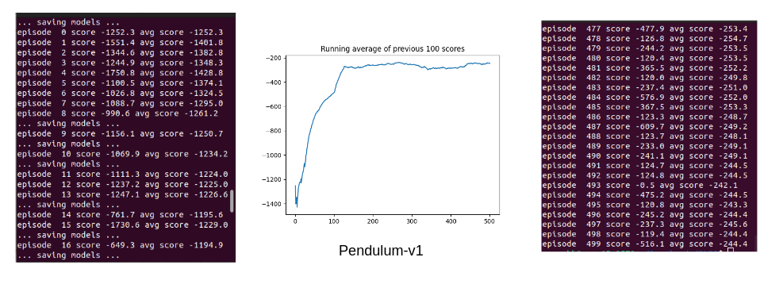
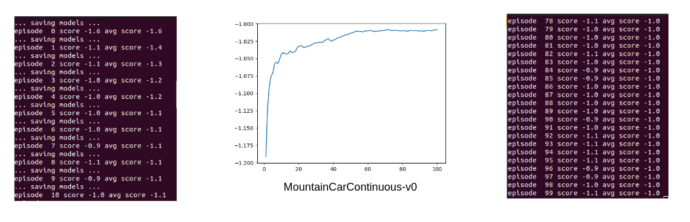

# Deep Deterministic Policy Gradient
<b> References : </b> 
  Deterministic Policy Gradient Algorithms : http://proceedings.mlr.press/v32/silver14.pdf
  Continuous control with deep reinforcement learning : https://arxiv.org/abs/1509.02971

<ul>
  <li> In Policy Gradient algorithms, policy is represented by a parametric probability distribution that stochastically selects action a in state s according to parameter vector θ.
  <li> In our project we instead consider deterministic policies.
  <li> In the deterministic case it only integrates over the state space, so computing the stochastic policy gradient may require more samples.
  <li> In order to explore the full state and action space, a stochastic policy is often necessary. To ensure that the deterministic policy gradient algorithms continue to explore satisfactorily, an off-policy actor-critic algorithm was used.
</ul>

## Results : 
1. Pendulum-v1 (256x256 neurons)

 
2. Pendulum-v1 (512x512 neurons) 

 
3. MountainCarContinuous-v0 

